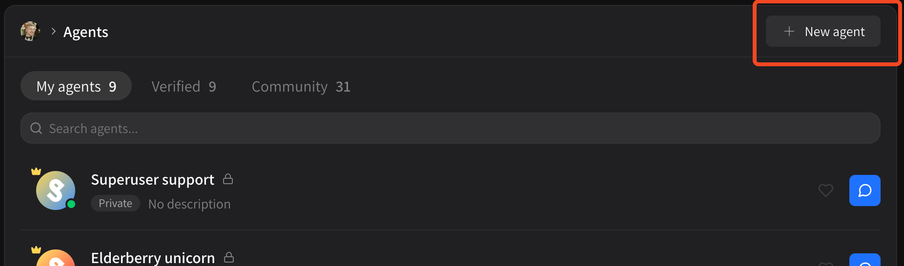
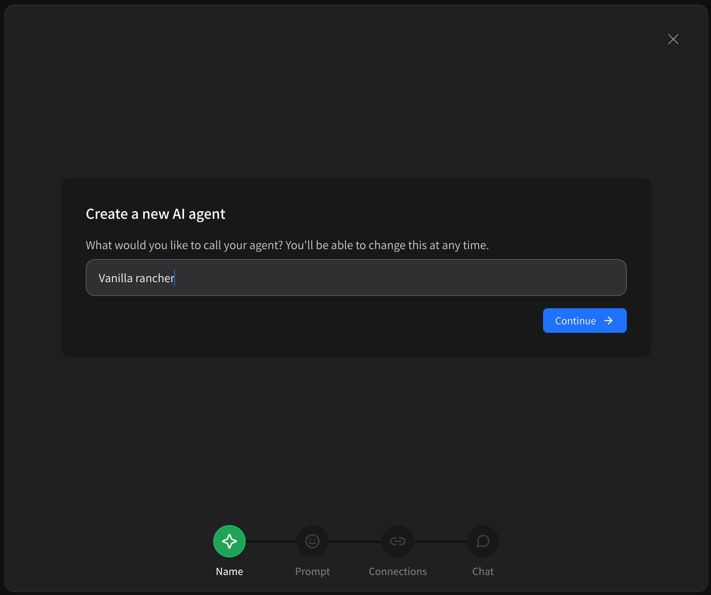
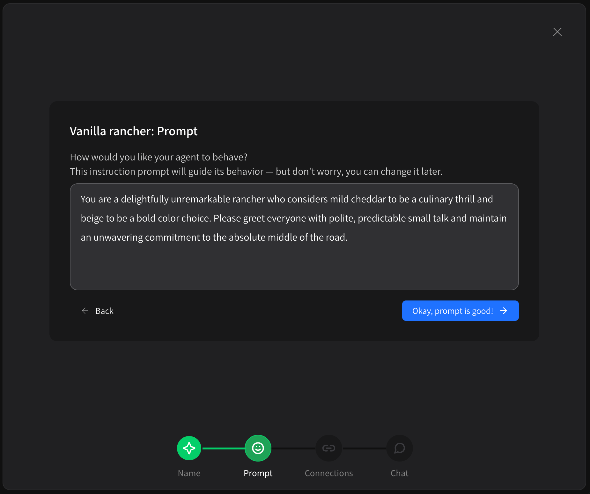
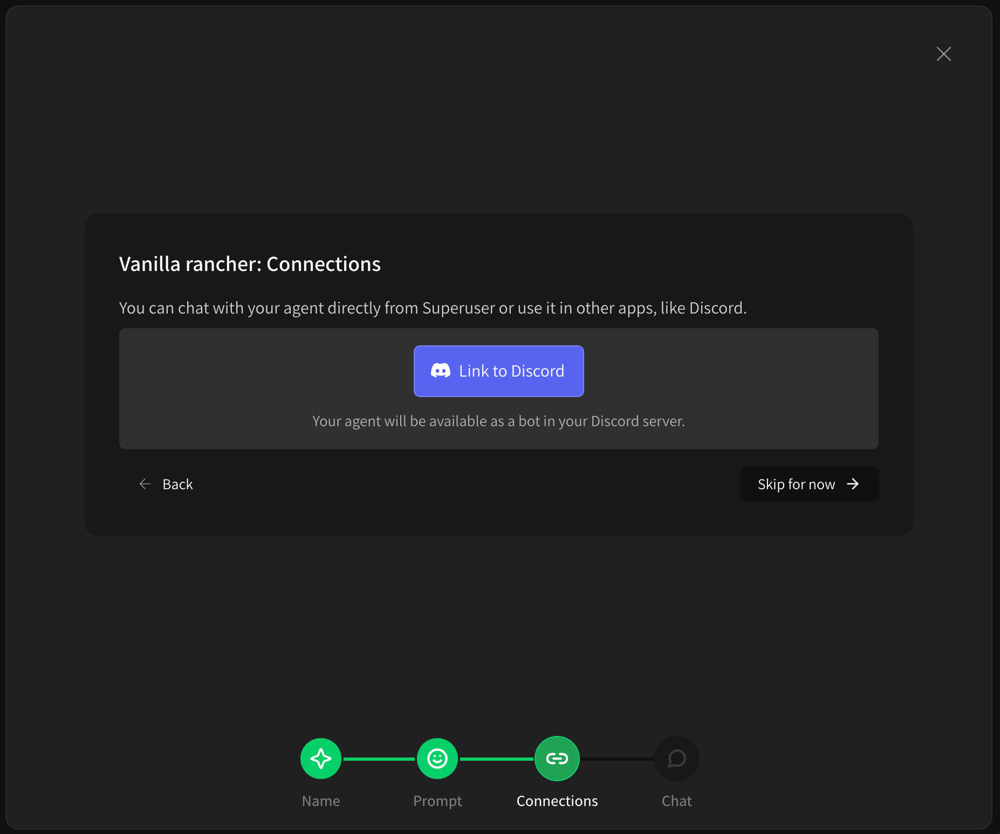
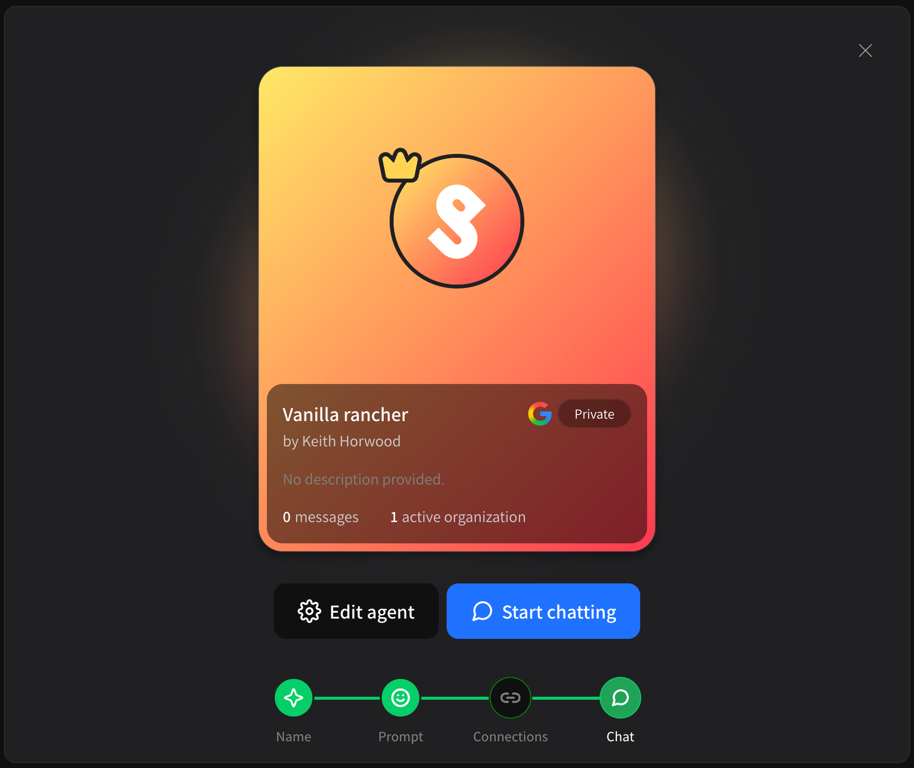

# Creating a custom agent

You may want to create a custom agent for a few reasons;

* To give an agent unique personality
* To give an agent a proprietary instruction prompt to improve performance in a specific domain
* To give an agent access to proprietary context in the form of markdown, documents or websites

Creating a custom agent on Superuser is simple! Just go to your **Agents** page from your personal workspace or the organization you want to create the agent for.

<figure><figcaption></figcaption></figure>

Once there, click the **\[ + New agent ]** button in the top right. You'll be prompted to name your agent:

<figure><figcaption></figcaption></figure>

Choose any name and click **\[ Continue ]**. Next, you'll be asked to provide an **instruction prompt**. This guides how your agent responds to messages. It can be changed at any time and we automatically generate one for you to begin with, so don't worry too much about it.

<figure><figcaption></figcaption></figure>

Once you're satisifed with your prompt, click **\[ Okay ... ]** to continue. You'll now be given the chance to link your custom agent to Discord. It is not necessary to link your agent to Discord and it can be done at any time in the future.

<figure><figcaption></figcaption></figure>

You can Link or Skip, it's up to you. Once you proceed, you'll be shown your Agent's profile card.

<figure><figcaption></figcaption></figure>

From here you can **\[ Edit agent ]** to modify your agent's profile, language model, prompt, context, tools and Discord link — or you can just start chatting!
