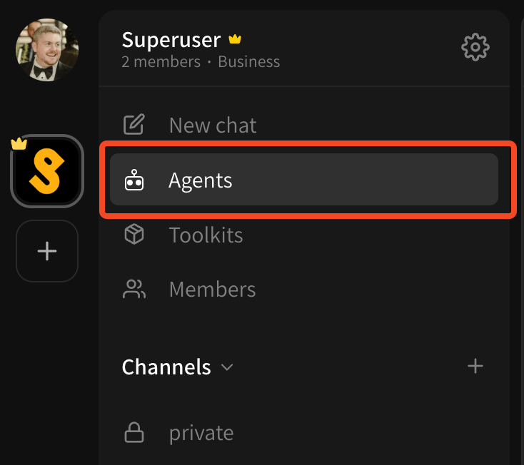
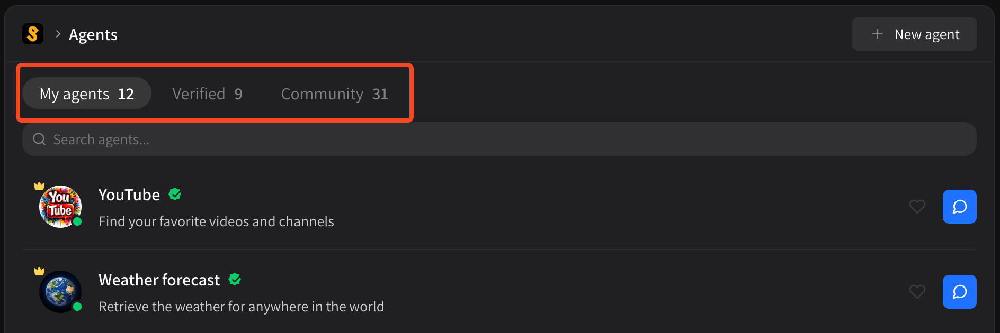
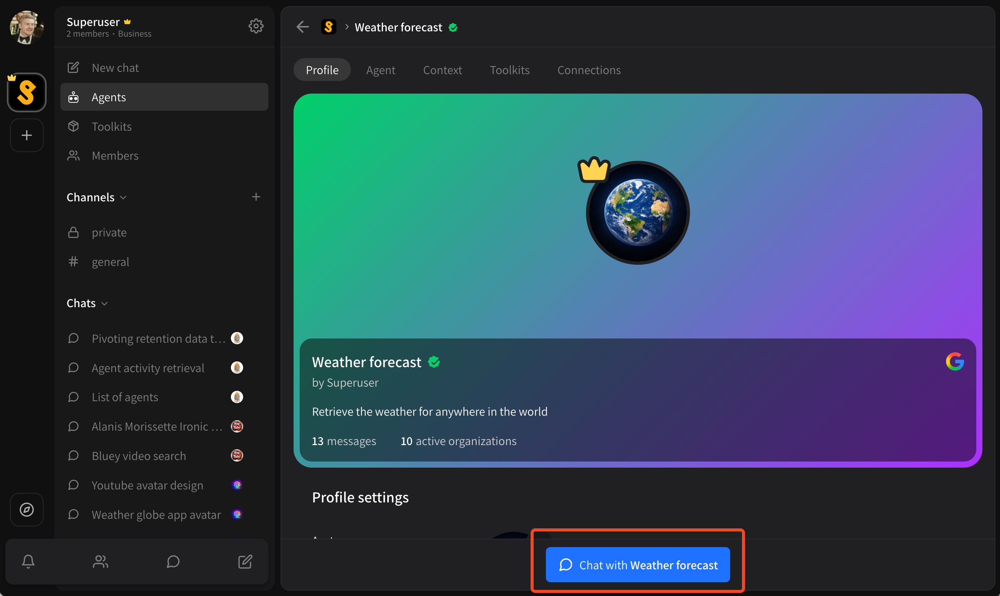

# Getting started with agents

An agent on Superuser is a scaffold for an AI assistant that contains;

* A **profile**
* A **language model**
* An **instruction prompt**
* Context in the form of **markdown**, **documents** and **websites**
* A recommended **set of tools**

However, **any agent can install any tool**. The "agent" itself is just a proprietary combination of { profile, LLM, prompt, context }.

## Adding agents to your organization

In order to talk to agents, or allow other members of your organization to chat freely with agents, you'll need to first **add them to your organization**.

First, find an agent you want to add by clicking on the **\[ Agents ]** link under the primary actions for your organization.

<figure><figcaption></figcaption></figure>

You'll see three tabs at the top of this page:

* My agents
  * Agents you have added to your organization (or personal account, depending on whether you are on your organization view or personal workspace)
* Verified
  * Agents that have been created by the community vetted and approved by the Superuser team
* Community
  * Agents that have been created by the community but have not been vetted

<figure><figcaption></figcaption></figure>

If you haven't created any agents yet, you'll want to peruse the **Verified** or **Community** sections.

Now, find an agent, and click on it to select it and read more about it. Once you've decided that you want to add this agent, just start a conversation with it! There's a button to start a conversation at the bottom of the screen on every agent page.

<figure><figcaption></figcaption></figure>

Click the **\[ Chat with ... ]** button and send a message to add the agent. You **must** send a message for the agent to be added to your organization properly.
