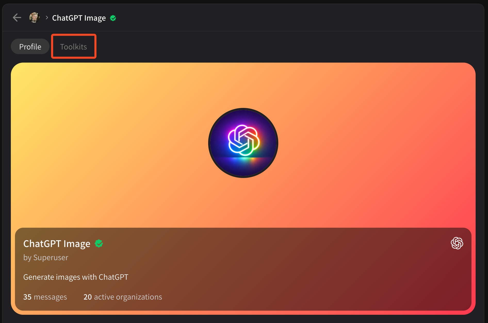
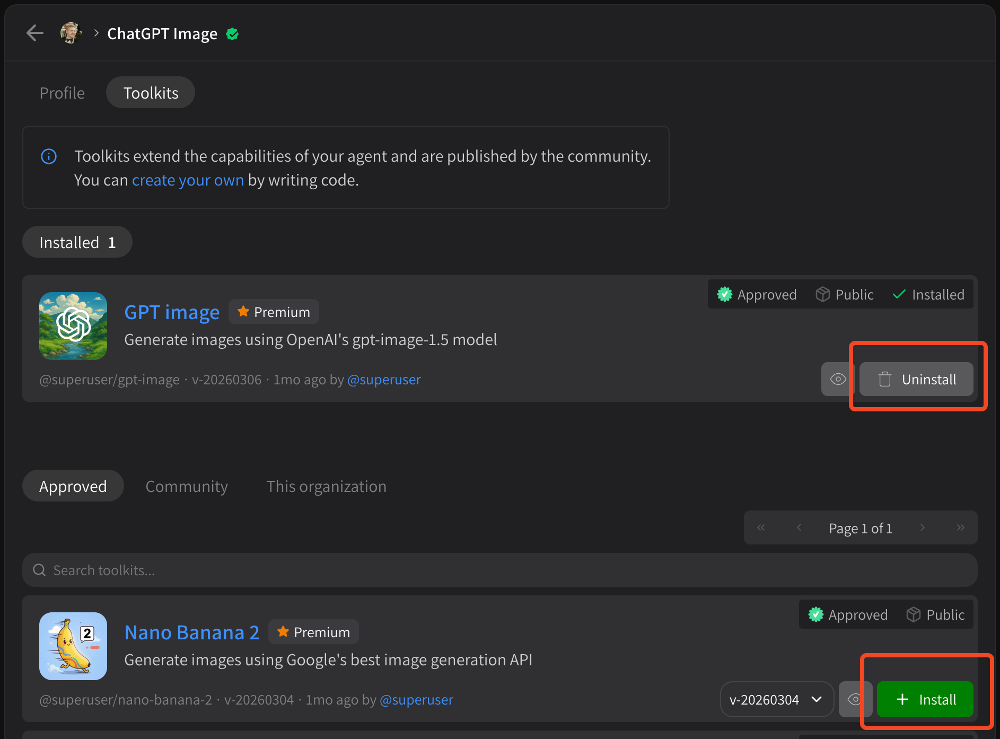

# Installing tools

Once an agent has been added to your organization or personal account, you can modify which tools it has available and even add new tools.

**Any agent can install any tool.** If you like an agent that somebody else has built, you can append your own tools to it to extend it. To modify tools for an agent you've installed, select the agent from the **My agents** to view its profile:

<figure><figcaption></figcaption></figure>

Click on the **Toolkits** tab to manage tools. Here you can **Uninstall** existing tools or **Install** new tools. Try out any combination you'd like!

<figure><figcaption></figcaption></figure>

Note that some tools are **Premium**, meaning they cost credits to run. You'll be notified before you install and asked to approve the installation. **You will not be charged for installing a Premium tool, only using it.**
