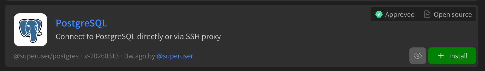
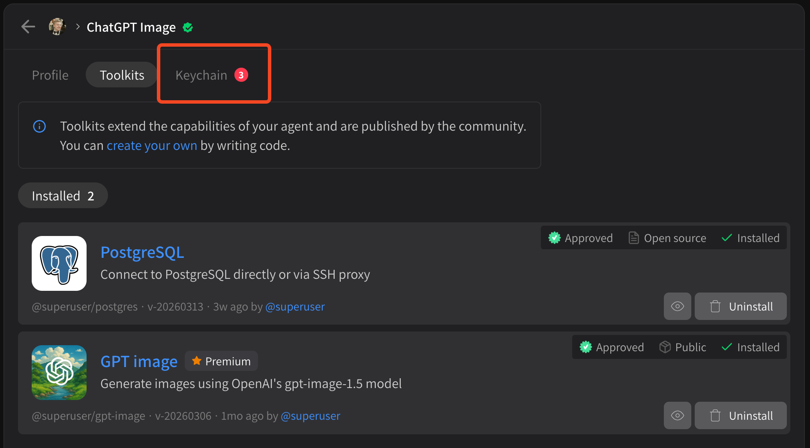
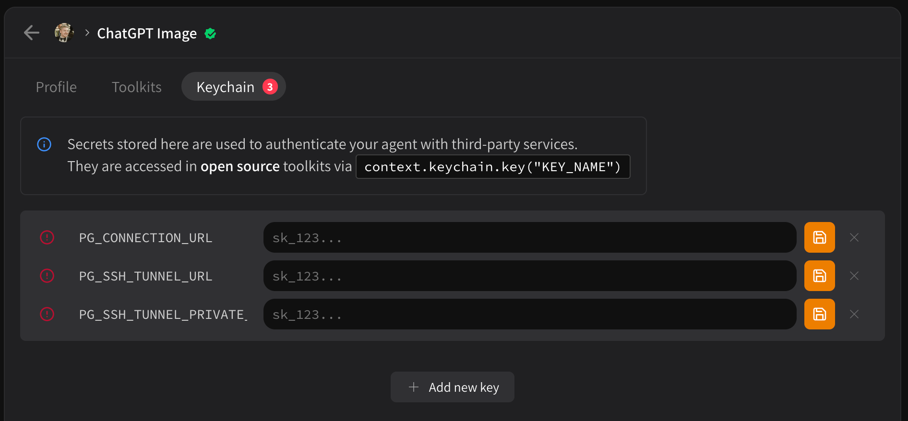

# Secrets and security

Some tools require **secrets** like API keys or database passwords in order to be used correctly.

* Only **open source** tools can request secrets
* You can **always** inspect the code that you share your secrets with
* If package code changes, **your installation will be invalidated**, so your agent will **never** run untrusted code with your secrets
* Secrets are stored on an **API keychain** which only exposes secrets **specifically requested** by the tool, which is set by the developer.

To manage secrets, first find a package that requires secrets like **PostgreSQL**:

<figure><figcaption></figcaption></figure>

Click **\[ Install ]**. If the package requires secrets, a new **Keychain** tab will appear:

<figure><figcaption></figcaption></figure>

Click this tab to view your API keychain.

<figure><figcaption></figcaption></figure>

Here you can save your secrets. **If a secret is not required, just save the empty textbox**. For example, in the PostgreSQL example above, PG\_SSH\_TUNNEL\_URL and PG\_SSH\_TUNNEL\_PRIVATE\_KEY can be saved as empty strings if the connection URL does not require a proxy.
