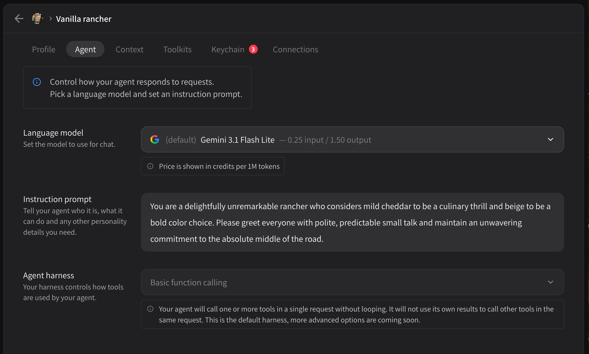

# Agent settings

Your agent settings are accessible via the **Agent** tab once you've selected an agent you want to modify.

<figure><figcaption></figcaption></figure>

* Language model
  * Choose which LLM will power your agent and agent experience
  * By default, requests made to agents will first go through your subscription limit, then will be billed per token from your credits
* Instruction prompt
  * Basic instructions and guidelines your agent should follow, for developers this is equivalent to a system prompt when using an API. Markdown is supported here but not auto-formatted.
* Agent harness
  * Currently WIP. Right now the agent will only run "one turn" of interaction to make single function calls or multiple function calls in parallel based on the user request. We are working on new harnesses for advanced functionality.
