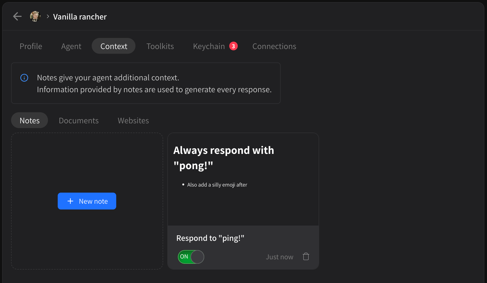

# Context: Markdown, Websites, PDF

The **Context** tab has three sub-tabs: **Notes**, **Documents** and **Websites**.

<figure><figcaption></figcaption></figure>

* Notes
  * Markdown documents
  * Included in **every request**
  * Can be used to expand upon prompt in a configurable way
  * Can be turned off at any time without deleting
* Documents
  * Upload documents to give agent smarter context
  * Undergoes **retrieval**, e.g. not included in every request by default: compared to and ranked against user request by similarity
  * Retrieval system automatically batches and groups relevant sections together&#x20;
* Websites
  * Similar to documents, website is crawled for individual pages that act like documents
  * Undergoes **retrieval**, e.g. not included in every request by default: compared to and ranked against user request by similarity
  * Retrieval system automatically batches and groups relevant sections together&#x20;
