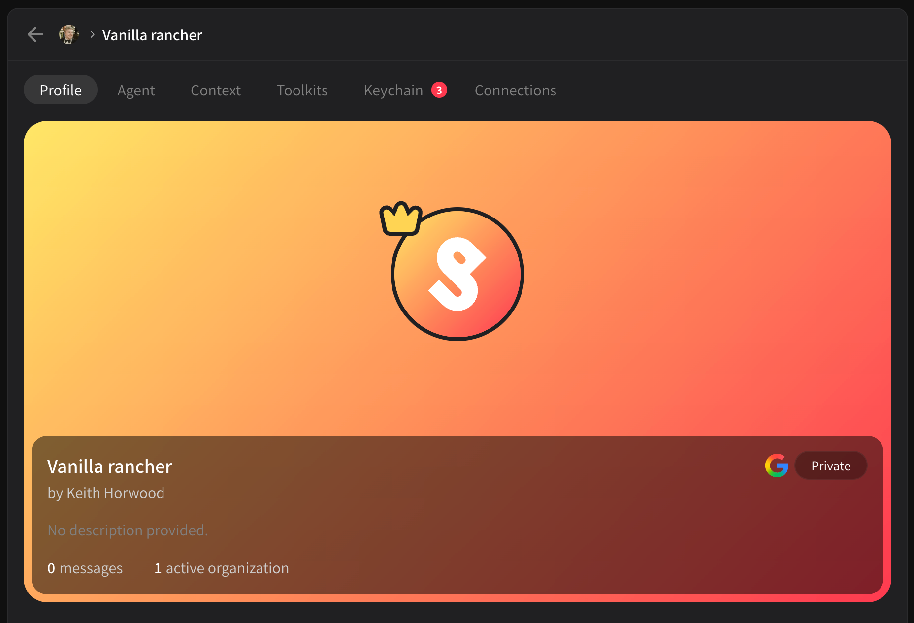
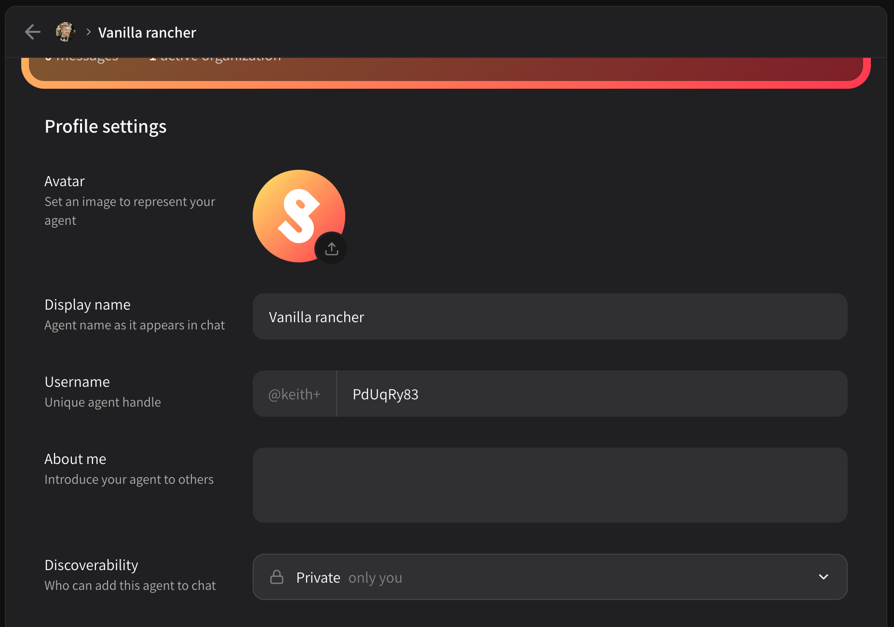
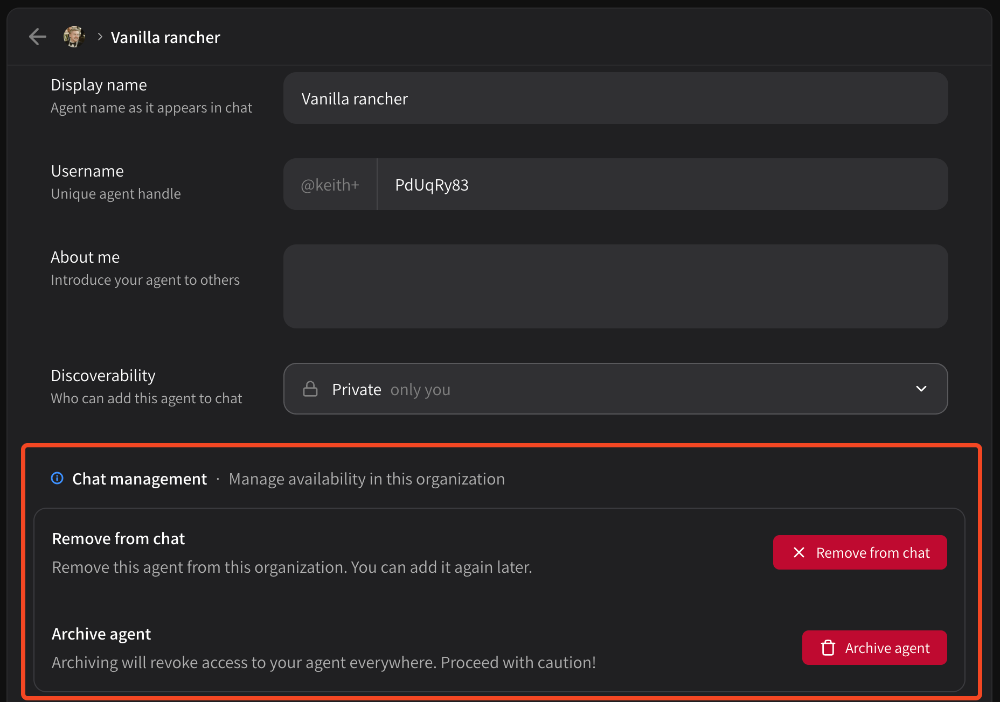

# Profile

Your agent profile page shows a brief summary of your agent, including the number of messages it has processed and how many organizations it is active in. On this page you can:

* [Change your agent's profile](profile.md#change-your-agents-profile)
* [Remove from chat or archive agent](profile.md#remove-from-chat-or-archive-agent)

<figure><figcaption></figcaption></figure>

## Change your agent's profile

To change your agent's profile, simply scroll down on this tab. You'll see **Avatar**, **Display name**, **Username**, **About me** and **Discoverability**.

<figure><figcaption></figcaption></figure>

* Avatar
  * Upload any image, we will automatically resize and center the image for you
* Display name
  * How your agent's name appears in chat
* Username
  * How you can @-mention your agent
  * Usually the UI handles this for you
  * It will always be prefixed with `@yourusername+` or `@orgname+`
* About me
  * A nice description that tells your teammates what the agent is for or encourages other users to take a look, if public
* Discoverability
  * Who can see and chat with this agent?
  * Default is **Private**, only you or the organization it was created in
  * **Unlisted** won't show up in the Community tab, but you can direct link others
  * **Public** shows up in the community tab

## Remove from chat or archive agent

Scrolling a little further will bring you to **Chat management**. Here you can archive your agent (if you created it) or remove it from chat if you simply added somebody else's public agent.

<figure><figcaption></figcaption></figure>

