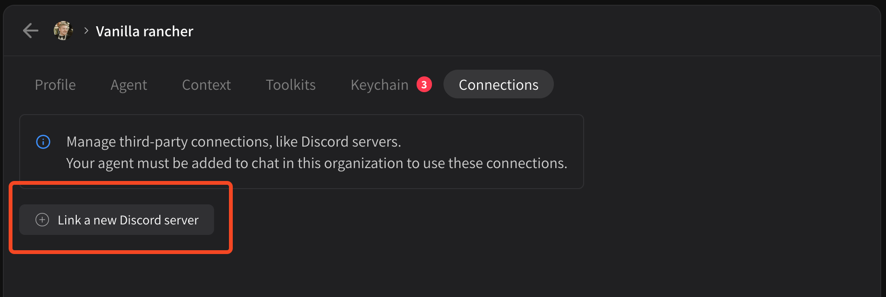
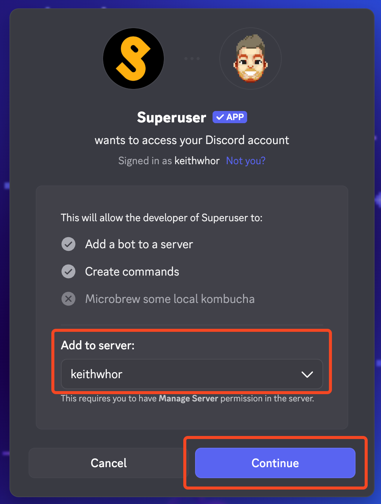

# Third-party connections

Right now, Superuser supports **linking agents to Discord**. It is easy and takes less than a minute, but there are a few limitations;

* Only **one** agent can be linked per Discord server via our official app
* You may be rate limited if you try to change your agent name too frequently, just be patient and try again later
* If you want multiple agents in a server, use Superuser [Organizations](../../team-chat/organizations-teams/) instead

To link an agent to Discord, go to **\[ Agents ] > \[ My agents ]**, find your agent, the select the **Connections** tab.

<figure><figcaption></figcaption></figure>

Click on **\[ Link a new Discord server ]**. You'll be prompted by Discord to select a server and continue:

<figure><figcaption></figcaption></figure>

Follow Discord's instructions, click continue, and your agent will be added to your Discord server. It's that easy!
