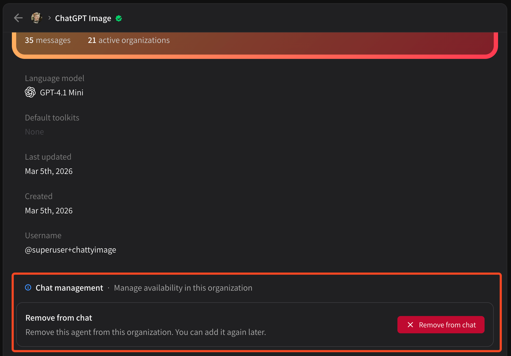

# Removing agents

Removing an agent from your organization is simple. Just go to **\[ Agents ] > \[ My agents ] >** select the agent you wish to remove. Scroll down on its **Profile** tab to find **Chat management**:

<figure><figcaption></figcaption></figure>

Click **\[ Remove from chat ]** and voila, this agent has been removed from the organization.
