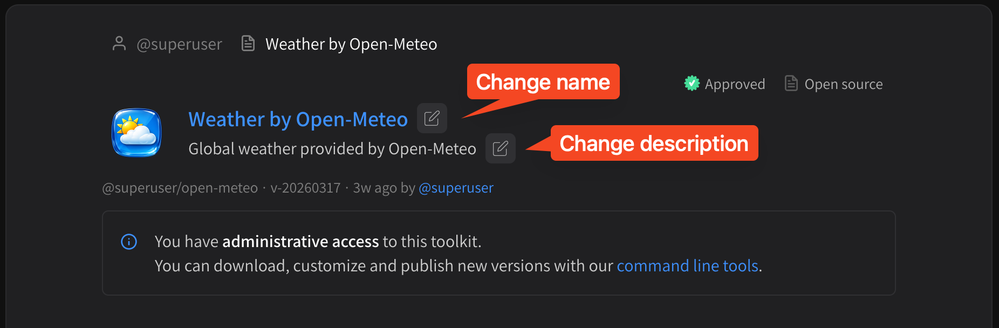
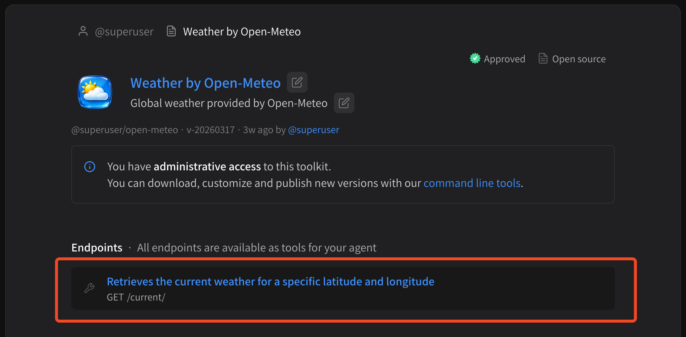
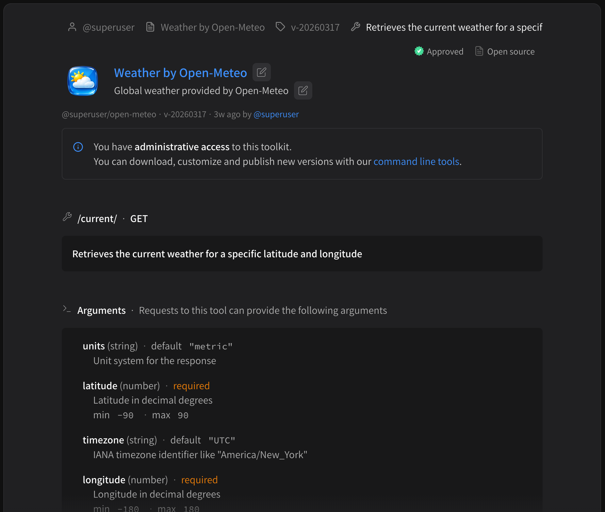
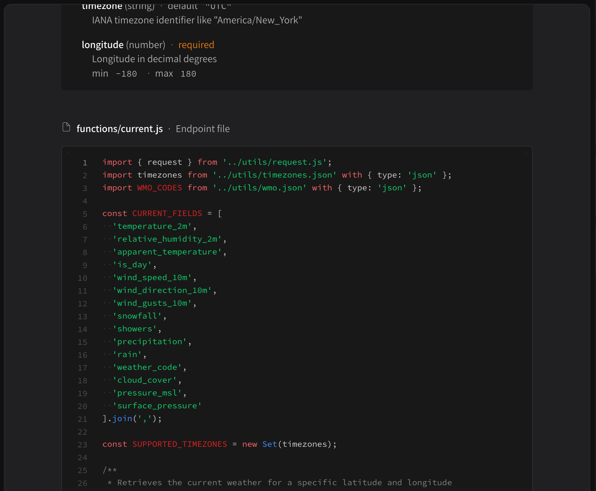
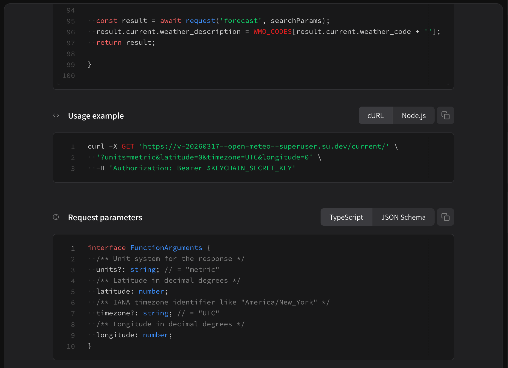

# Managing tools

You can manage your tools directly via their page in the package registry. We'll use the [Superuser: Weather by Open-Meteo](https://superuser.app/org/superuser/toolkits/open-meteo) as an example, available at [https://superuser.app/org/superuser/toolkits/open-meteo](https://superuser.app/org/superuser/toolkits/open-meteo).

## Change name and description

<figure><figcaption></figcaption></figure>

To change the name and description of your tool, once it's published just click the edit button next to the name or description.

## View endpoint (and code)

Every tool in a package is just an API endpoint, because Superuser tool packages are just APIs hosted on serverless infrastructure. To view an endpoint and see information about it — like description, parameters, etc. — just click on it in the endpoints list.


Only **open source** packages will show endpoint code. Public and private packages will not show code.


<figure><figcaption></figcaption></figure>

Once you've selected the endpoint, you'll be able to see more details:

<figure><figcaption></figcaption></figure>

* Endpoint pathname and description
* Arguments

<figure><figcaption></figcaption></figure>

* Endpoint code (if applicable)

<figure><figcaption></figcaption></figure>

* Usage example (how to cURL or execute via Node.js)
* Request parameters (TypeScript or JSON Schema)
