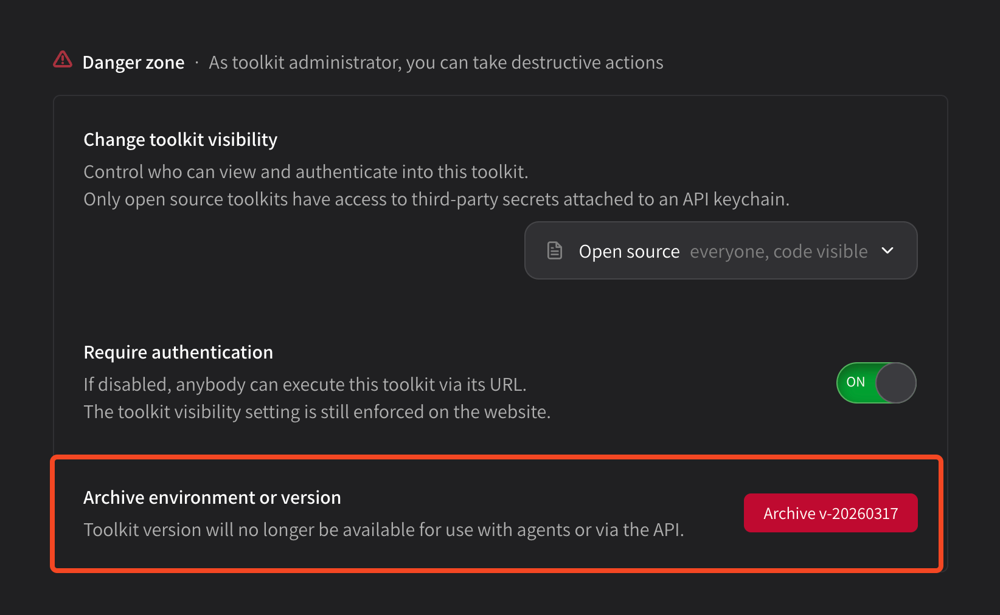

# Archiving tools

You can archive a tool at any time in the **Danger zone** settings at the **bottom of your tool package page**. You can only archive one environment or version at a time, so if you need to remove an entire package with a long version history you will need to repeat this several times.

<figure><figcaption></figcaption></figure>

Click the **\[ Archive ]** button and you will be asked to confirm. Once confirmed, your tool package will be archived.
