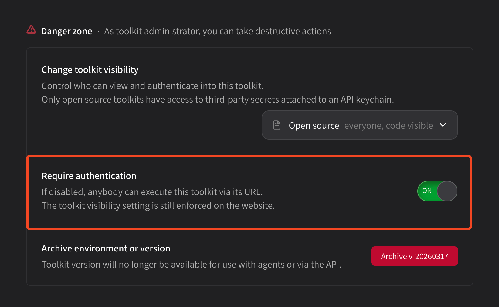

# Tool authentication

You can change tool authentication at any time in the **Danger zone** settings at the **bottom of your tool package page**. This controls whether or not your tool requires a Superuser API keychain to be executed.


If disabled, **your tool can be executed on the open web by anybody**.



Normally, authenticated requests are billed to the requester.

However, you **will be billed directly** for unauthenticated requests to your tools.


<figure><figcaption></figcaption></figure>

Click this switch to OFF to disable authentication. Authentication is enabled by default. You will be asked to confirm before the change is made.
