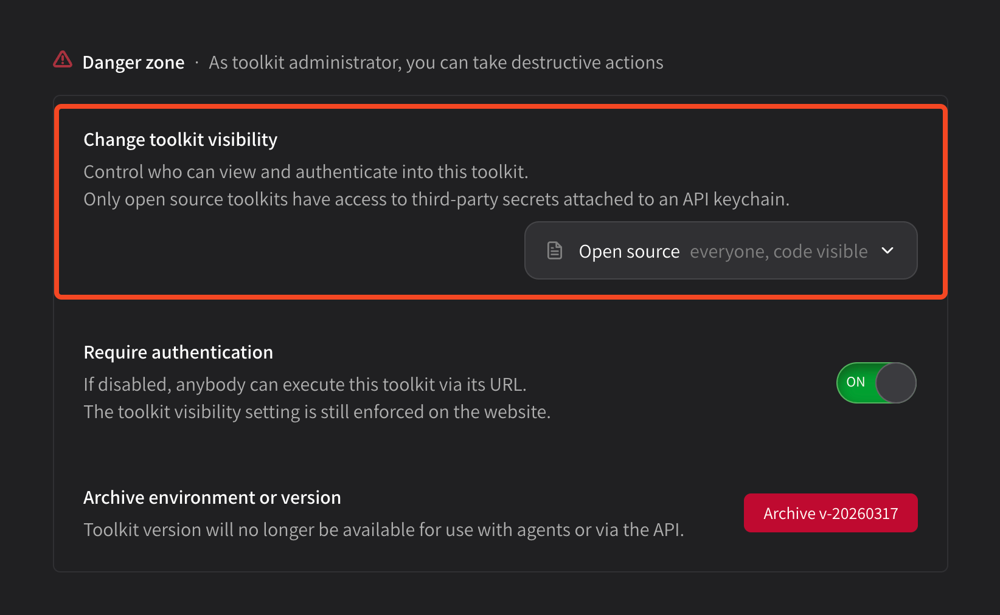

# Tool visibility

You can change tool visibility at any time in the **Danger zone** settings at the **bottom of your tool package page**.


The default visibility is **private.** If you change to **open source**, everybody will be able to see your source code! Be careful.


<figure><figcaption></figcaption></figure>

Tool packages come in three flavors;

* `private`&#x20;
  * Can only be executed by API keychains created by your organization
    * Thus can only be used by agents inside your organization, because agents have keychains scoped to the organization they're installed to
    * e.g. Public agent with private tool installed will not be able to execute it
  * Source code is **not visible**
  * Secrets can **not be shared** with these tools
* `public`&#x20;
  * Can be executed by any API keychain
    * And thus, any agent at any time
  * Source code is **not visible**
  * Secrets can **not be shared** with these tools
* `open_source`&#x20;
  * Can be executed by any API keychain
    * And thus, any agent at any time
  * Source code is **visible**
  * Secrets **can be shared** with these tools, as they are inspectable

Select the new visibility you'd like and then confirm, and your package details will be updated.
