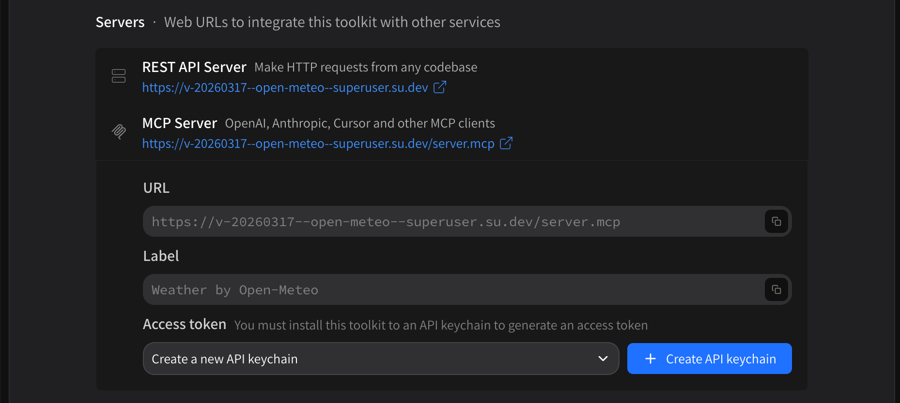

# Using tools outside of Superuser

Since every Superuser tool package is just an API server, it's easy to use Superuser tools outside of Superuser. Every package page comes with its own **Servers** section.

<figure><figcaption></figcaption></figure>

* The **REST API Server** is the URL the tool package is available at on the open web
  * This will **always** require authentication (see individual endpoint page for code examples) unless you specifically turn authentication off for your tool
  * Authentication uses [API keychains](../publishing-tools-via-command-line/api-keychain-specification.md) which can be managed from your personal or organization dashboard under the **Developer** heading
* The **MCP Server** is the URL that the package is available at as an MCP server for use in other products
  * You can generate an API keychain from the package page directly if you need to
