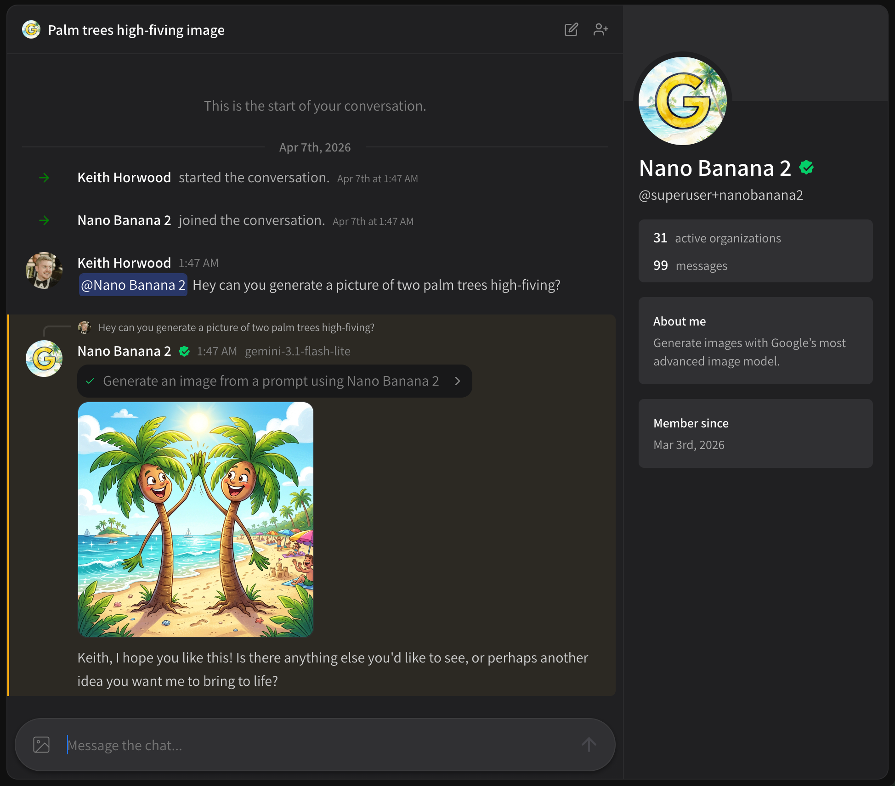
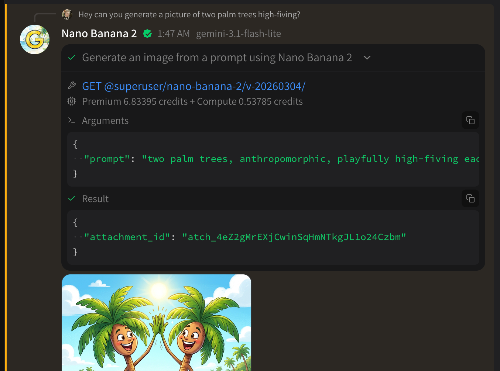

# Using tools in chat

Using tools in chat is easy. Once you've installed tools to an agent, just ask it to perform a task that would use a tool!

* [Using a tool](using-tools-in-chat.md#using-a-tool)
* [Inspecting tool details](using-tools-in-chat.md#inspecting-tool-details)
* [How compute credits work](using-tools-in-chat.md#how-compute-credits-work)

## Using a tool

Here's an example of generating an image:

<figure><figcaption></figcaption></figure>

Here I've asked an agent with the [Nano Banana 2](https://superuser.app/org/superuser/toolkits/nano-banana-2) toolkit to:

> Hey can you generate a picture of two palm trees high-fiving?

And that's all it took to work!

## Inspecting tool details

Once a tool has run, you can click on it to expand and see details.

<figure><figcaption></figcaption></figure>

In this case I can see;

* The tool that was requested
* The compute credit fee (in this case, 6.8 credits + 0.5 credits of compute)
* The arguments provided to the API endpoint (all tools are APIs!)
* All files are saved as attachments, any raw data output will be shown as JSON

## How compute credits work

In the example above, you'll notice the request was billed for **Premium** + **Compute**.

* **Premium** is developer-defined compute pricing, intended to cover costs of performing the task. You'll see these charges with things like media generation.
* **Compute** is platform-defined, and is billed at 50 credits per 1,000 GB-s of usage. 1 GB-s of usage = 1GB of RAM in use for 1 second. You can read more on our [pricing page](https://superuser.app/pricing).
