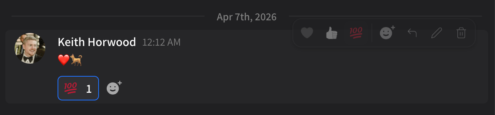
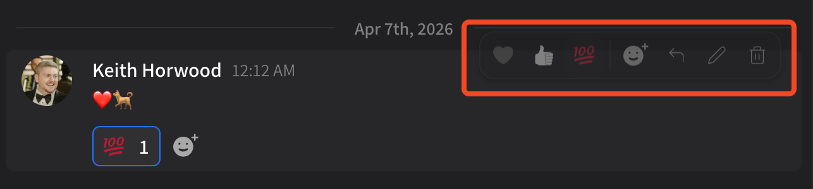
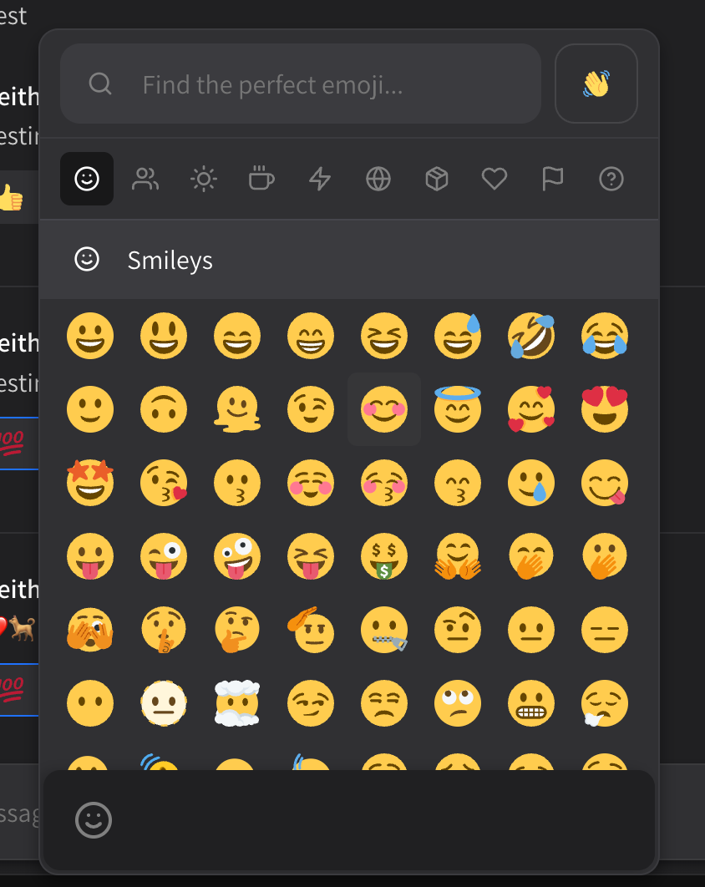

# Emojis and reactions

Emojis are currently supported in Superuser via unicode; e.g. if your device lets you insert and display an emoji, it'll appear!

<figure><figcaption></figcaption></figure>

Reactions can be added via the quick reply menu. Simply hover over any message on desktop / web, or press-and-hold on mobile:

<figure><figcaption></figcaption></figure>

By default we support ❤️, 👍 and 💯 as quick reactions. You can click the smiley face with a plus to view our full reaction emoji list:

<figure><figcaption></figcaption></figure>

Here you can select your favorite emoji, search for emojis, and change emoji skin tone.
