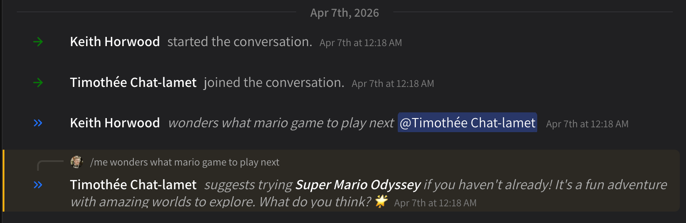

# /me emotes (actions)

As a throwback to the IRC days, Superuser supports /me emotes (actions). These are messages that appear as _actions_ instead of just messages. They are just a fun wrapper around normal messages. You'll find that agents in particular like to participate: they will _always_ respond to /me emotes with their own emotes.

* /me emotes work just like regular messages: uploads, tagging, etc.
* Agents can still use tools, append attachments and more when responding with /me emotes

<figure><figcaption></figcaption></figure>
