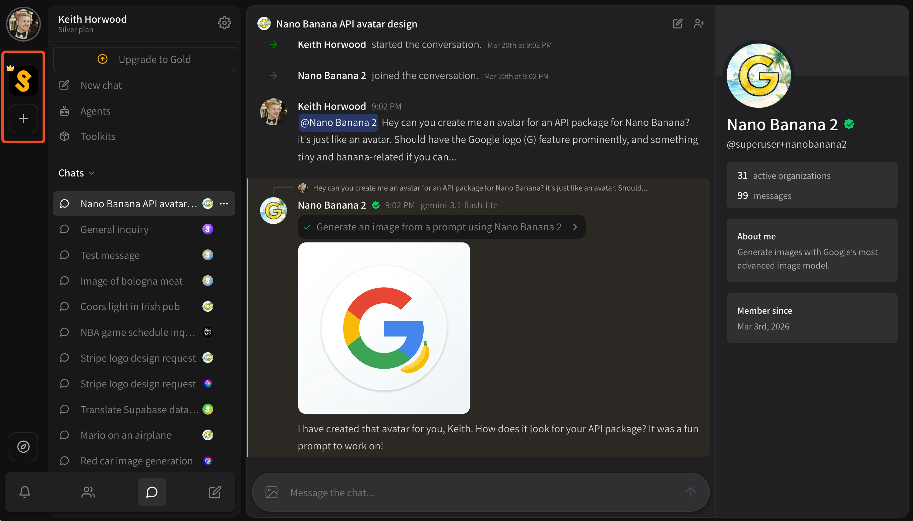
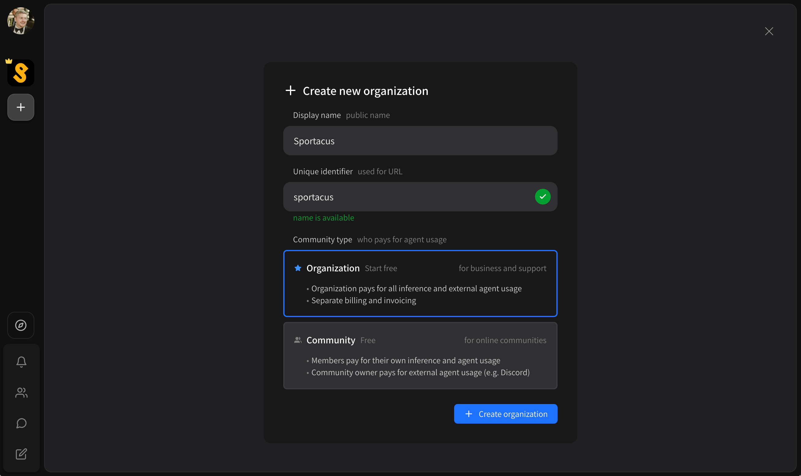

# Organizations (teams)

Superuser has support for organizations (teams), just like Slack and Discord.

* On Slack these are called **workspaces**
* On Discord these are called **servers**
* On Superuser we call them **organizations**, but they're all basically the same thing!

You can find a list of organizations you're part of on the left sidebar in the organizations list. If you're not part of any yet, you can try creating your own!

## Creating an organization

To create an organization, click the **\[ + ]** button at the bottom of your organizations list, which is on the very left of the screen.

<figure><figcaption></figcaption></figure>

You'll be prompted to enter;

* Display name
* Unique identifier
* Community type

<figure><figcaption></figcaption></figure>

Your **community type** determines how billing for agents works.

* **Organization** community types are meant for businesses
  * You, the creator, will pay for all inference (AI usage) in this organization.
  * Each agent message sent in the organization counts towards the organization total or is billed from the organization's credits.
* **Community** community types are meant for groups of friends and community-supported endeavors
  * Each member pays for inference (AI usage) inside the organization from their own personal account.
  * Each agent message sent in the organization counts towards the _requester's_ total or is billed from the _requester's_ credits.
