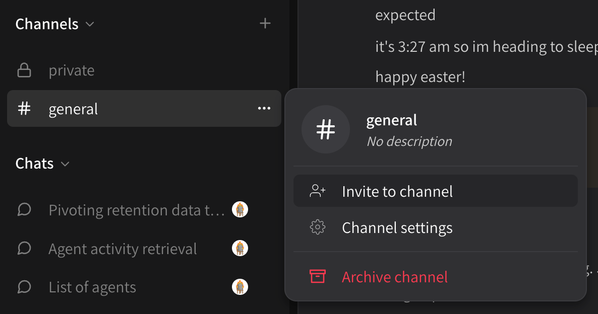

# Inviting new members

To invite new members to an organization, **create invites for any public channel**. You can do this from the **\[ . . . ]** button next to the channel name:

<figure><figcaption></figcaption></figure>

Or in the channel title bar:

<figure><figcaption></figcaption></figure>

You can then send invites via email directly, or copy and paste a link:

<figure><figcaption></figcaption></figure>
