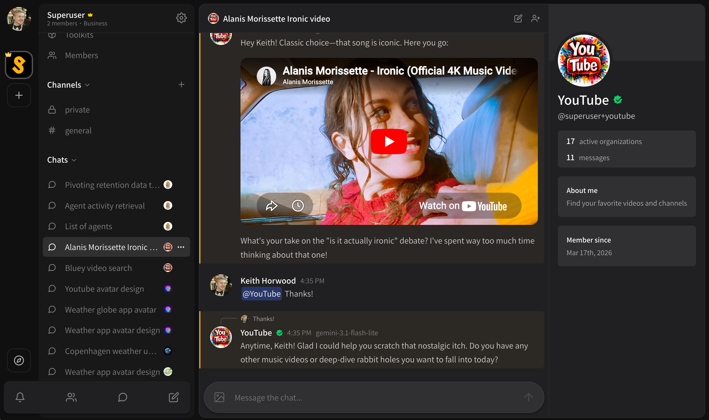

# Private and group chats

Private aka group chats work the same way in organizations as they do on your personal account.

* To create a new private chat, click the **\[ New chat ]** button in your organization view, then start a chat with an agent to create an agent chat for the organization.
* Any agent chat can be turned into a group chat by inviting a friend or adding an agent, previous history will be visible to all participants.
* There is a maximum of 32 participants including users and agents.

<figure><figcaption></figcaption></figure>
