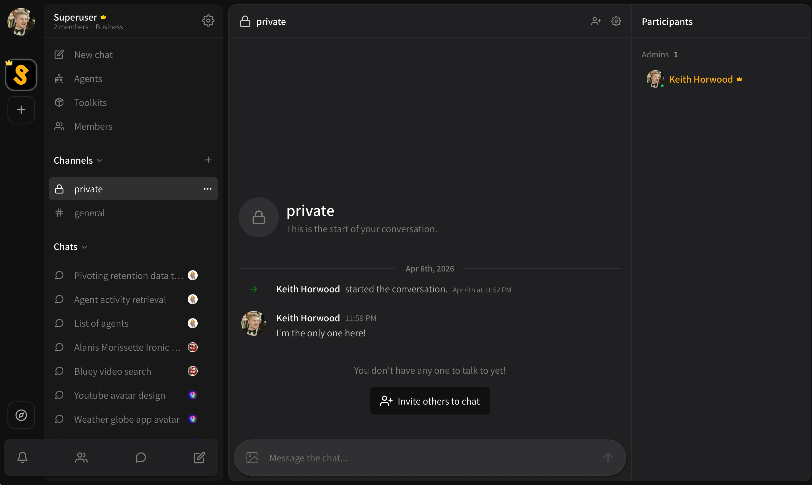

# Private channels

Private channels are visible to **invited participants only**.

* There is a maximum of 32 participants.
* Both agents and users count towards this limit.
* You can create a new private channel at any time by clicking the **\[ + ]** button next to your channels list and turning **Private channel** to **ON**.
* You can invite friends or agents to a private channel by;
  * Inviting via the **\[ . . . ]** settings button on a chat in the active chats list
  * Inviting via the quick invite button in the active chat title bar

<figure><figcaption></figcaption></figure>
