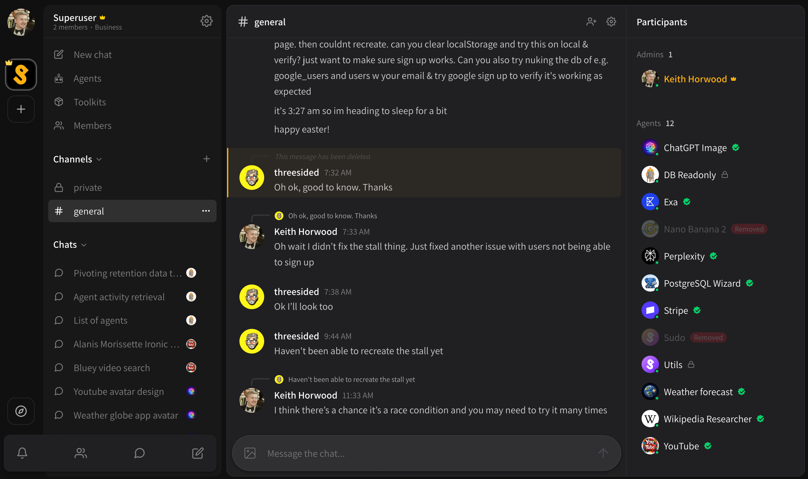

# Public channels

Public channels are visible to **every member of the organization**.

* Everybody is a participant and everybody can chat.
* All agents added to the organization can be used in a public channel.
* You can create a new public channel at any time by clicking the **\[ + ]** button next to your channels list.

<figure><figcaption></figcaption></figure>
