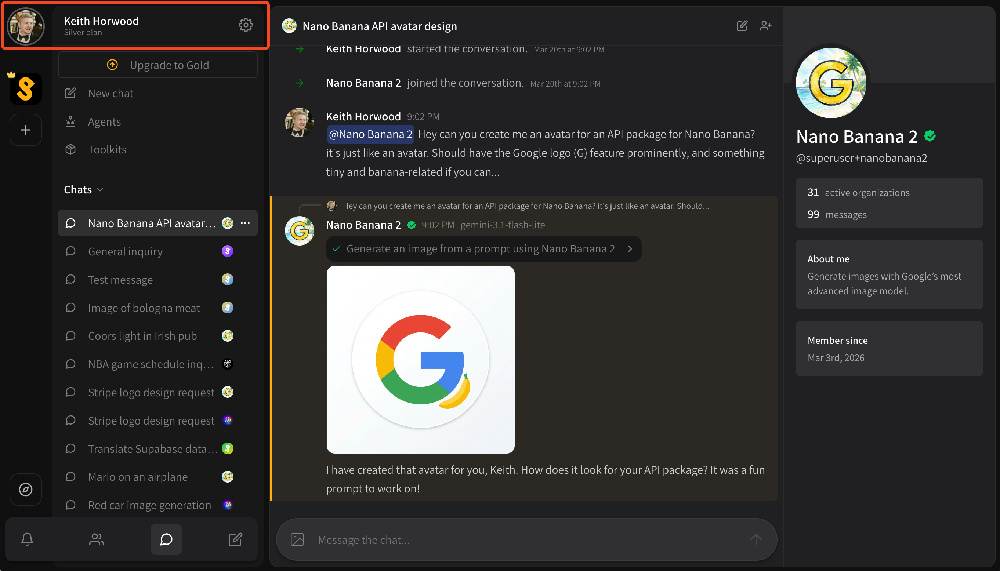
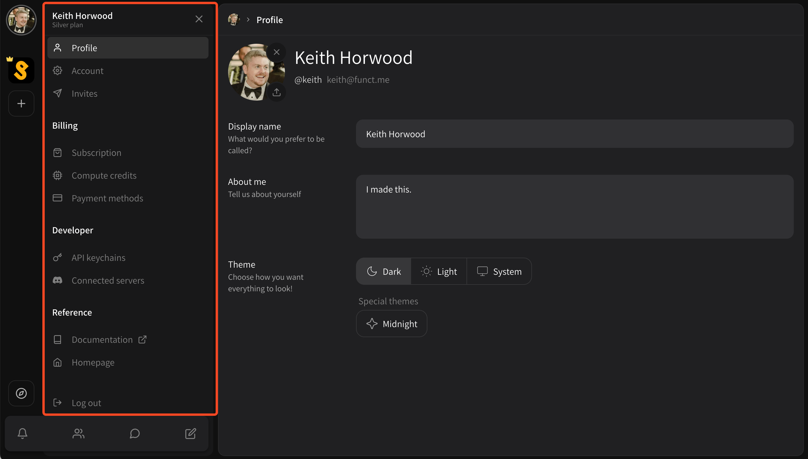
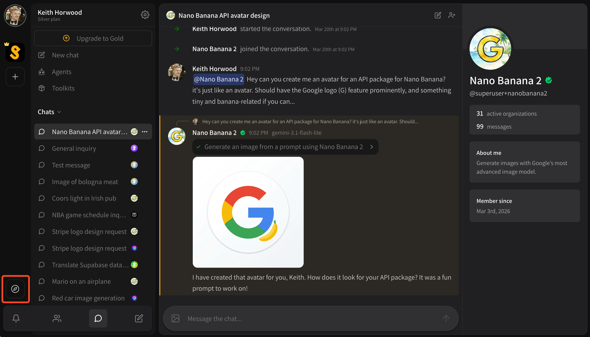
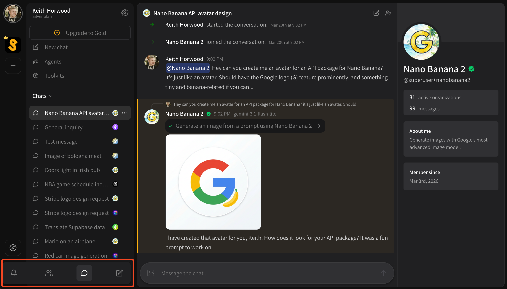
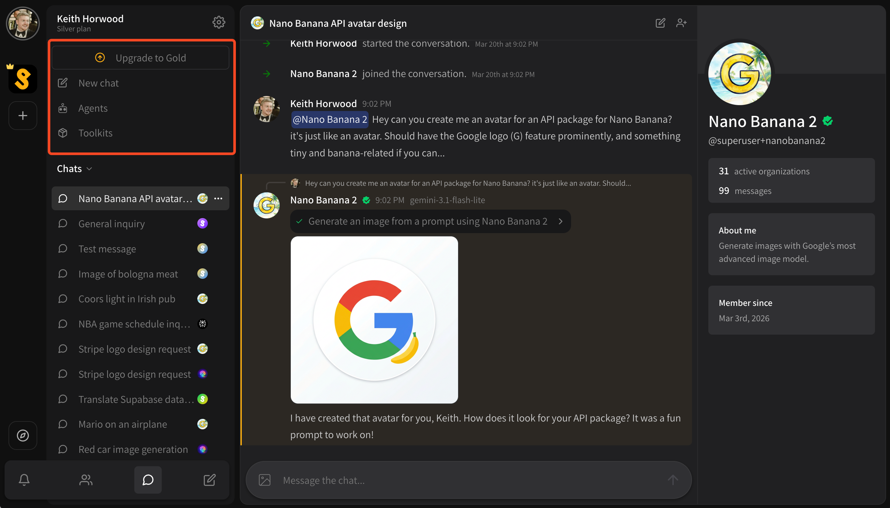
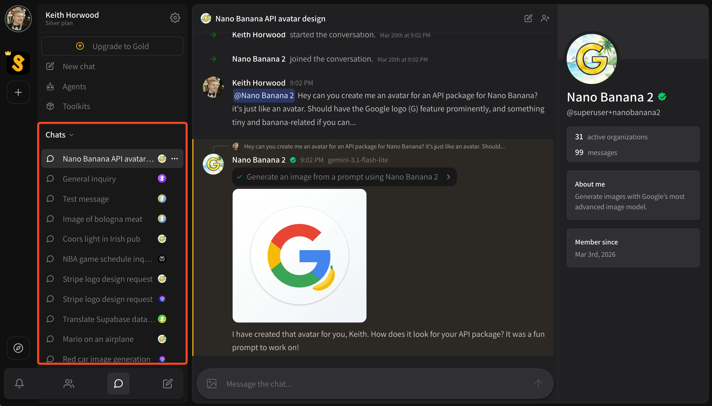
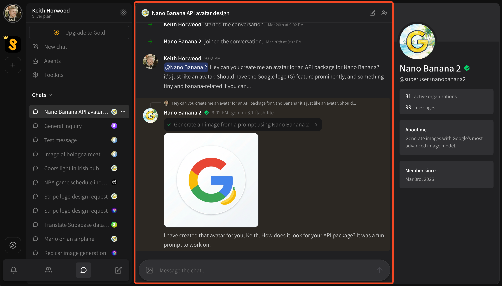
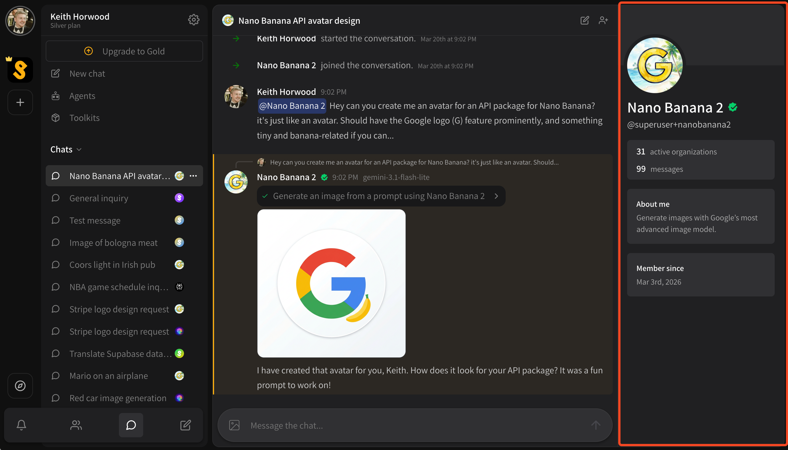

# Your workspace

If you're familiar with ChatGPT, Discord and Slack, the Superuser interface should feel familiar. In this guide we'll cover the web and desktop interface, but the mobile interface is very similar. We'll cover the basics for you to make it easy. Your workspace can be segments into several sections;

* [User menu](./#user-menu)
* [Organizations list](./#organizations-list)
* [Discover button](./#discover-button)
* [Quick navigation](./#quick-navigation)
* [Primary actions](./#primary-actions)
* [Active chats](./#active-chats)
* [Chat window](./#chat-window)
* [Chat summary](./#chat-summary)

## User menu

<figure><figcaption></figcaption></figure>

Your user menu is in the **top left** of your workspace. You can access your personal organization view — where you can manage your own private agents, tools and chats — at any time by clicking your avatar in the top left. Once selected you'll also see a **settings cog** on the very right of the user menu. Click this at any time to visit your personal dashboard.

### Personal dashboard

<figure><figcaption></figcaption></figure>

Your personal dashboard can be used to;

* Profile
  * Edit your profile and about me
  * Change your theme
* Account
  * Change your username
  * Change your password
* Invites
  * Manage personal invitations to chat
* Billing
  * Manage your subscription
  * View compute credit balance and add credits
  * Manage payment methods
* Developer
  * Manage API keychains to use tools with third-party services
  * Manage which Discord servers your agents are connected to
* Reference
  * View documentation
  * View the homepage
* Log out

## Organizations list

<figure><figcaption></figcaption></figure>

The organizations list is on the left of the screen, immediately under the user menu. When you select an organization from this list, you'll immediately enter the [organization view](../organizations-teams/). You can also click the **\[+]** button to create an organization.

### Discover button

<figure><figcaption></figcaption></figure>

The discover button is on the bottom left of your workspace, immediately above the quick navigation menu. Click this to easily discover agents and tools published by Superuser and the community.

## Quick navigation

<figure><figcaption></figcaption></figure>

The quick navigation is located in the bottom left of your workspace and has four icon buttons;

* Notifications
  * Quickly view your notifications over the last 30 days and clear all notifications
* Friends
  * [Manage your friends](adding-friends.md)
* Chats
  * Shortcut to your private chats
* New chat
  * [Chat like ChatGPT, Claude or Gemini](chat-like-chatgpt-claude-or-gemini.md): use this as a shortcut to start a new conversation in your personal workspace with your favorite agent

## Primary actions

<figure><figcaption></figcaption></figure>

Your primary actions for your personal workspace are available just under your user menu, in the leftmost panel after your organizations list. You must have your own workspace selected to view it. If you are not currently subscribed to a personal plan, you'll see an upgrade notice here. Otherwise, there are three main actions;

* New chat
  * [Chat like ChatGPT, Claude or Gemini](chat-like-chatgpt-claude-or-gemini.md): use this as a shortcut to start a new conversation in your personal workspace with your favorite agent
* Agents
  * View, manage and chat with agents you have added to your personal account
* Toolkits
  * View and manage tools you have published to your personal account

## Active chats

<figure><figcaption></figcaption></figure>

Your active chats for your personal workspace will show a list of all direct messages, agent chats and group chats you have started that are **not part of an organization**.

* Direct messages will show the **user icon on the left**
* Agent chats and group chats will show **all participant icons on the right**
* You can click on the three dots **\[ . . . ]** to the right of a DM or chat to change the chat settings or archive the chat

## Chat window

<figure><figcaption></figcaption></figure>

The chat window is the primary communication interface for both other people and agents on Superuser. When you have a direct message, agent chat or group chat selected, the contents will appear here along with a textbox to send messages with.

* At the top of the chat window is the chat title. If you are in an agent chat, you'll see a new chat icon to quickly start a new chat with the same agent. Any agent chat or group chat will also have an invite button to easily add new users. Agent chats can be turned into group chats instantly.
* **Group chats started from DMs will create a new chat**. New members will not be able to see chat history.
* **Group chats started from agent chats will add new members to the existing chat**. New members will be able to see chat history.
* Upload files to chat by pressing the image icon to the left of the chat textbox at the bottom of the screen.

## Chat summary

<figure><figcaption></figcaption></figure>

The chat summary is on the right of the screen. It shows you information about the current chat or direct message.

* For direct messages, it will display the user and information about their friends list
* For agent chats, it will display statistics about agent usage
* For group chats, it will display a list of participants
