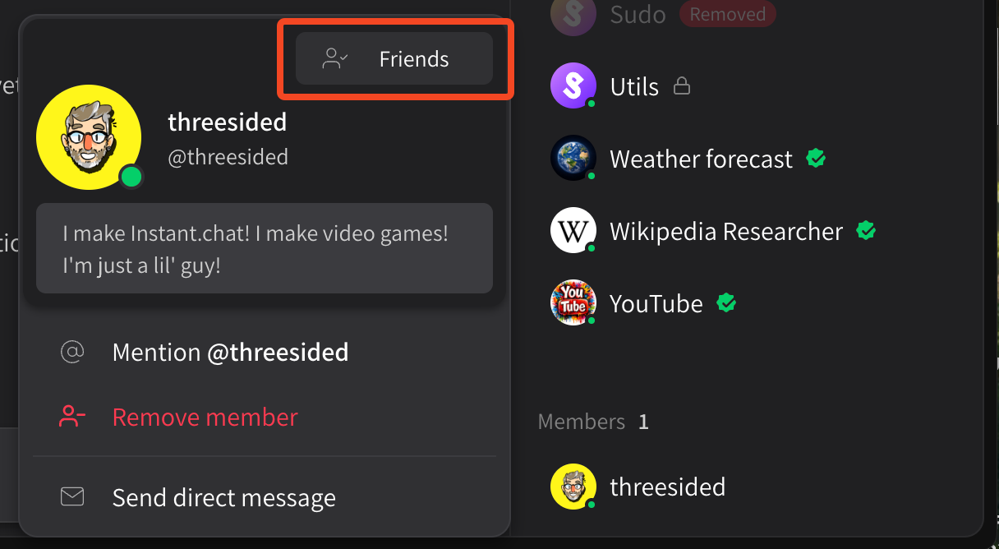
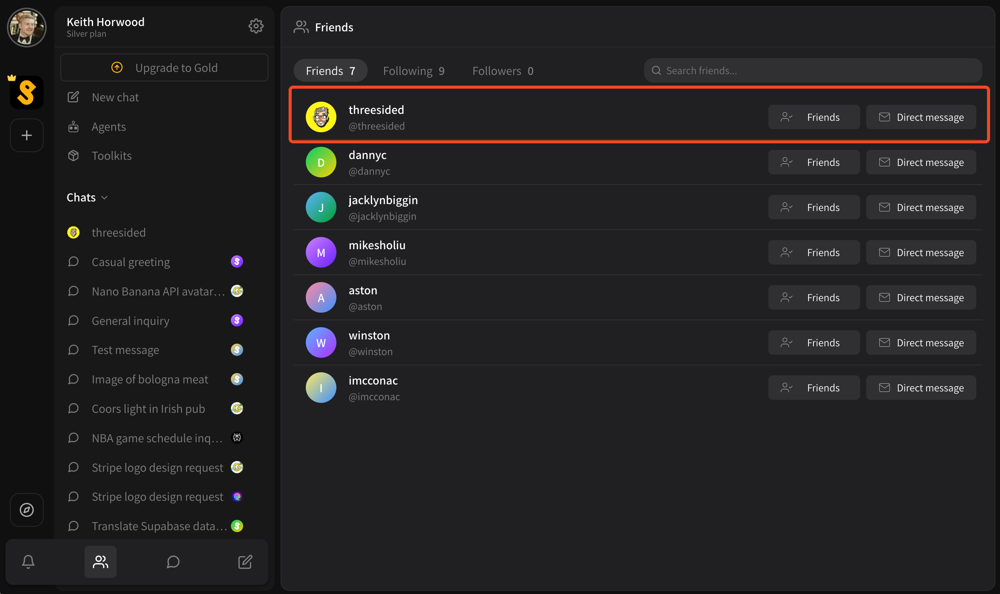

# Adding friends

While on Superuser, you may encounter people you particularly enjoy chatting with. These could be friends, colleagues at work or anybody, really! You can add a friend at any time by clicking the **\[ Add friend ]** button by their name anywhere you can see their profile.

<figure><figcaption></figcaption></figure>

In this example, I've seen a friend in the Members list of a public channel I'm part of. I just clicked on his name, and I can see I'm already friends! If you're not friends yet, you can use this button to add them.

You can also see the same button if you have a direct message or private chat with the person:

<figure><figcaption></figcaption></figure>

Finally, if you want to manage your friends list, click the **Friends** icon in the Quick navigation menu at the bottom right of your screen:

<figure><figcaption></figcaption></figure>

Here you'll be able to see all your friends, as well as the one you just added!
