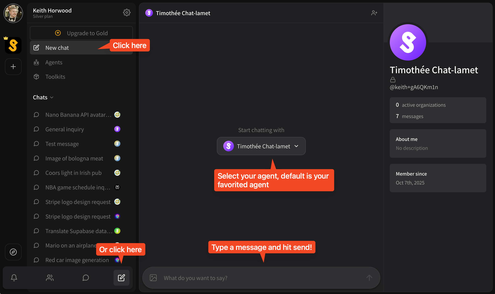
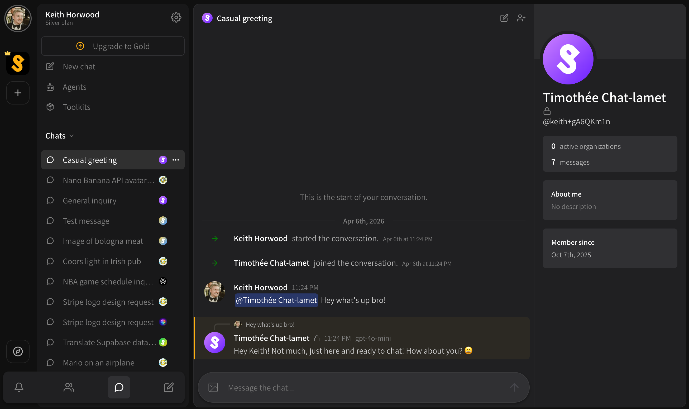

# Chat like ChatGPT, Claude or Gemini

You do not need to work with a team to make use of Superuser, you can use it just like you would ChatGPT, Claude or Gemini — only you get to use your personal agents that you have customized instead.

To start a new **Agent chat** with an AI agent, just click the **\[ New chat ]** button under your primary actions in your workspace.

<figure><figcaption></figcaption></figure>

You'll be brought to the new chat interface with your favorite agent already selected. Just type a new message and hit send to start a conversation.

<figure><figcaption></figcaption></figure>

That's it! You can now chat back-and-forth with your agent just like you would use ChatGPT, Claude or Gemini.
