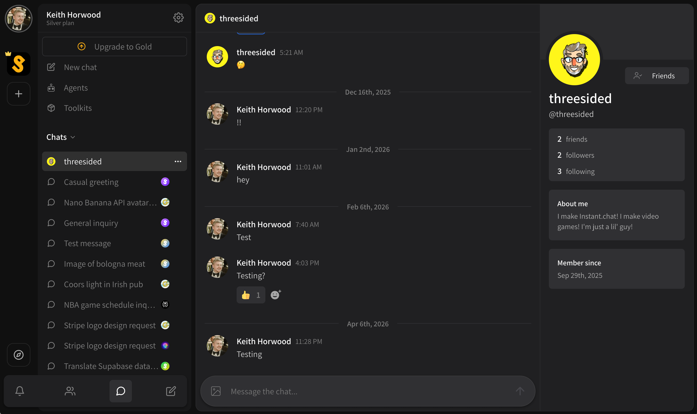

# Direct messages

Direct messages are messages between **two people**. You **can not** start a direct message with an agent, you can only have agent chats. Each agent chat is its own context thread, which is helpful for managing agent memory, but people do not have the same limitations.

There are two ways to send a direct message;

* Send it from your friends page
* Click on a user in channel or chat you both participate in and then **\[ Send Direct Message ]**

<figure><figcaption></figcaption></figure>

That's it! Direct messages are easy.
