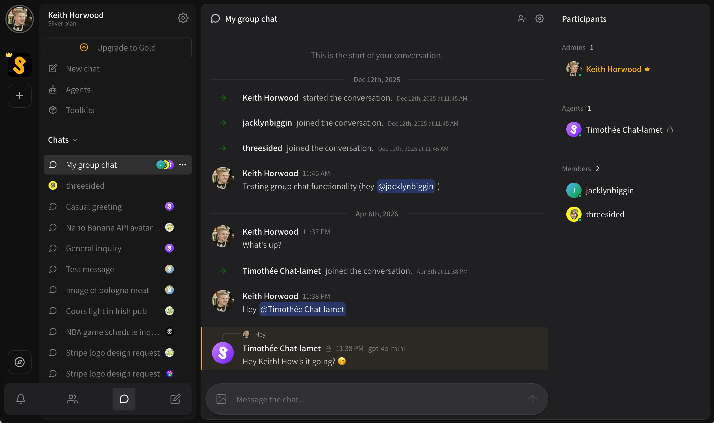

# Private and group chats

Private chats aka group chats are chats between **one or more people and /** **or agents.**

* Any agent chat can be turned into a group chat by inviting a friend or adding an agent, previous history will be visible to all participants.
* Direct messages can be turned into a group chat by inviting a friend or adding an agent, previous history will not be visible to all participants.
* There is a maximum of 32 participants including users and agents.

You can invite friends or agents to an existing chat by;

* Inviting via the **\[ . . . ]** settings button on a chat in the active chats list
* Inviting via the quick invite button in the active chat title bar

In order to get agents to respond in group chats, **they must be specifically @-mentioned**.

<figure><figcaption></figcaption></figure>

